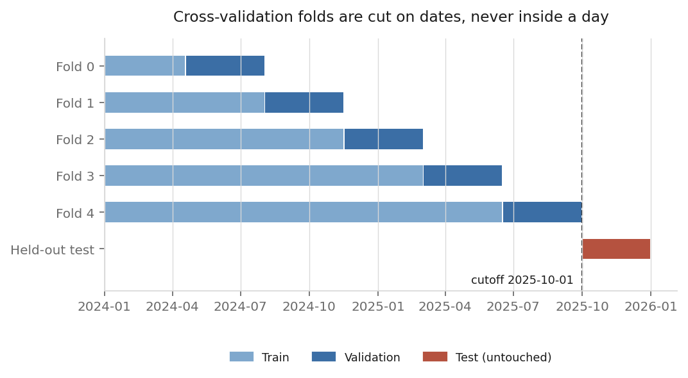
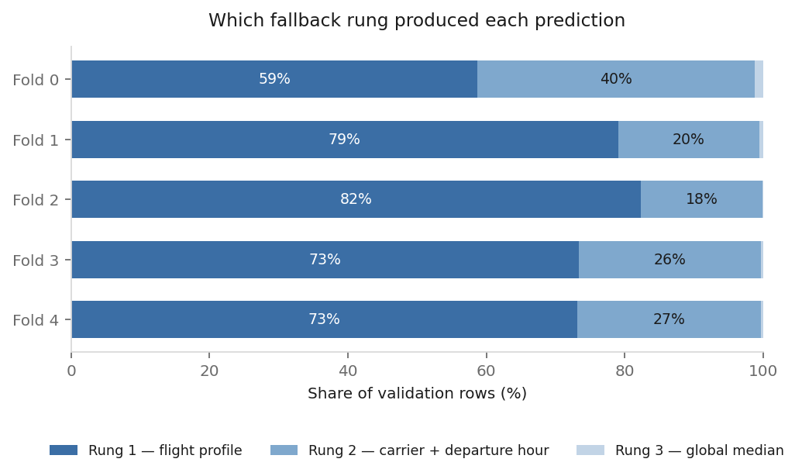
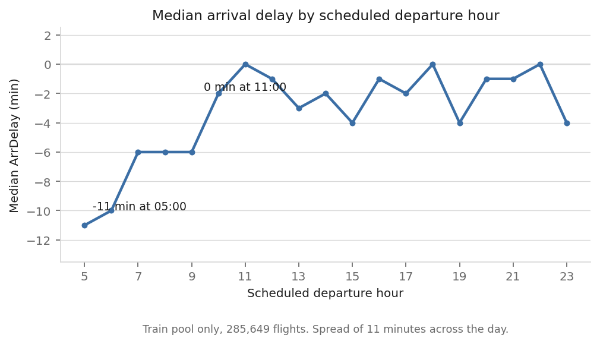

# Seattle Flight Reliability

Compares two Seattle-origin domestic flights on historical arrival delay, using BTS on-time data and only what a traveler knows before booking: carrier, destination, scheduled times, and date.

**Current status:** Data audits, cleaning, evaluation splits, and a median baseline are done. The baseline scores a mean cross-validation MAE of **19.95 minutes** across five temporal folds. No model is trained yet.

## Data

- **Source:** BTS TranStats, Reporting Carrier On-Time Performance
- **Period:** January 2024 through December 2025
- **Downloaded:** July 20, 2026
- **Scope:** SEA-origin U.S. domestic flights

The raw download contains 14,080,680 rows and 110 columns. Filtering to SEA departures leaves 328,559 rows. Removing rows with missing arrival delay (`ArrDelay`) leaves **324,490 flights**.

All 24 months were verified present. The audits cover missing values, duplicates, and feature availability.

Raw files are not tracked in Git. The cleaned dataset is written to `data/interim/seattle_ontime_clean.csv`.

## Setup and Reproduction

### Install dependencies

The project uses Python 3.13.9. Runtime dependencies are pinned in `requirements.txt`, including pandas 2.3.3, NumPy 2.3.5, and scikit-learn 1.7.2.

```bash
python -m venv .venv
```

Activate it. On macOS or Linux:

```bash
source .venv/bin/activate
```

On Windows (PowerShell):

```powershell
.venv\Scripts\Activate.ps1
```

Then install:

```bash
pip install -r requirements-dev.txt
```

`requirements-dev.txt` includes Jupyter. Use `requirements.txt` if you only need runtime dependencies.

### Download the data

Download monthly files from the [BTS Reporting Carrier On-Time Performance table](https://transtats.bts.gov/DL_SelectFields.aspx?gnoyr_VQ=FGJ&QO_fu146_anzr=b0-gvzr). Select every field and download January 2024 through December 2025, one month at a time.

The 24 downloads total roughly 677 MB compressed. Extract the CSVs into:

```text
data/raw/data_for_2024/*.csv
data/raw/data_for_2025/*.csv
```

Each directory should contain 12 monthly CSVs.

### Run the notebooks

From the repository root:

```bash
cd notebooks
jupyter notebook
```

Run the notebooks in this order:

| Notebook | Purpose | Output |
|---|---|---|
| `data_quality_audit.ipynb` | Check raw data counts, missing values, duplicates, and month coverage | Audit results documented in `reports/data_quality_audit.md` |
| `data_cleaning.ipynb` | Filter SEA departures and remove rows with missing `ArrDelay` | `data/interim/seattle_ontime_clean.csv` |
| `linear_baseline.ipynb` | Build evaluation splits, score the median baseline, and explore feature encoding | Fold definitions, baseline scores, and encoding analysis |

Notebook paths are relative to `notebooks/`. The first two notebooks read the raw files independently; the third requires the cleaned CSV.

### Check correctness

There is no standalone automated test suite yet. Running `linear_baseline.ipynb` executes assertions that check:

- Training and validation dates do not overlap within a fold
- The held-out test period starts after the training period ends
- Train and test row counts sum to the cleaned dataset’s row count

The notebook also counts baseline fallback usage for each fold. Reusable logic in `src/` and real tests come next.

## Features and Target

Every raw column was classified as a target, pre-booking feature, post-flight field, or field to drop. This left **13 pre-booking features** and the target, `ArrDelay`.

Actual flight times, departure delay, taxi time, air time, and delay-cause fields are excluded to prevent target leakage. `Origin` is excluded because every retained flight departs from SEA.

The dataset excludes rows with missing `ArrDelay`, including cancelled and diverted flights without a recorded arrival delay. Results therefore describe arrival delay among retained flights, not cancellation or diversion risk.

The full column audit is in `reports/feature_audit.md`.

## Evaluation

The data is split by calendar date:

| Partition | Period | Flights |
|---|---|---:|
| Train pool | January 1, 2024–September 30, 2025 | 285,649 |
| Held-out test | October 1–December 31, 2025 | 38,841 |

Model selection uses five `TimeSeriesSplit` folds within the train pool. The splitter operates on unique dates, then maps those dates back to flight rows. This keeps each day’s flights together.

All candidates will use the same folds. The final test set is reserved for one evaluation after model selection.



The folds use `gap=0`; current features contain no lagged or rolling values. Because the test period covers only October through December, its score will not represent year-round performance.

## Median Baseline

The baseline predicts arrival delay using training-set medians, with three fallback levels:

1. **Carrier + flight number + destination**, if the group has at least 10 training rows
2. **Carrier + scheduled departure hour**, if the group has at least 10 training rows
3. **Global training median**

Medians match the evaluation metric, mean absolute error (MAE), and are less affected by the long tail of large delays.

The baseline achieved a **mean cross-validation MAE of 19.95 minutes**, with a standard deviation of 1.21 minutes across five folds.



Flight-profile medians cover 59–82% of validation rows, depending on the fold. Carrier and departure hour cover most remaining rows; fewer than 1.5% use the global median in any fold.

Eleven groupings were evaluated for the second fallback. Carrier and departure hour performed best. On rows requiring a fallback, it reduced MAE relative to the global median by 0.415 minutes, compared with 0.149 minutes for carrier and destination.

The grouping was selected using the same cross-validation folds used to report performance, so the score has some selection bias. The held-out test set remains unused.

## Issues Found

### Splitting flight rows divided individual days

The initial cross-validation setup split rows directly. Daily flight counts vary, so all five boundaries placed flights from the same date in both training and validation.

Splitting unique dates and mapping them back to rows removed the overlap.

### Overall scores hid weak fallback performance

Most predictions use the first-level flight-profile median. Scoring the whole dataset made differences between fallback groupings appear small.

Evaluating only rows that needed a fallback showed that carrier and departure hour performed better than carrier and destination.



### Unknown carriers need explicit handling

With `OneHotEncoder(drop="first", handle_unknown="ignore")`, an unseen category and the dropped reference category both encode as all zeros.

No unseen carriers appeared in the validation folds, so cross-validation did not exercise this case. The planned interface must check carrier inputs against the fitted encoder’s `categories_` before predicting.

Investigating this behavior surfaced a separate defect in scikit-learn itself: the unknown-category warning text was chosen from `handle_unknown` alone, without consulting the fitted data, so it claimed unknown categories would be grouped into an infrequent category even when no such category existed. Fixed upstream in [scikit-learn#34861](https://github.com/scikit-learn/scikit-learn/pull/34861), merged September 2026.

## Next Steps

- Train and evaluate linear regression and random forest candidates
- Extract reusable notebook logic into `src/` and add automated tests
- Build the two-flight comparison interface with input validation
- Evaluate the selected model on the held-out test set
- Document model performance and limitations

## Repository Layout

```text
notebooks/       Data audit, cleaning, and baseline notebooks
reports/         Data provenance, quality, and feature audits
reports/figures/  README figures, regenerated by make_figures.py
data/raw/        Untracked BTS downloads
data/interim/    Cleaned SEA-origin dataset
```

## Project Scope

Built for learning and deployment practice. Consumer flight tools already report reliability. The comparison interface is not built yet.

## License and Data Use

Code and documentation are released under the MIT License; see `LICENSE`.

BTS data is not redistributed in this repository. Download it from TranStats using the instructions above and check the source’s terms before redistributing it.